# DesignFoundation Screenshot Catalog

Generated by `scripts/generate_screenshot_catalog.py` — do not edit by hand; re-run the script instead.

Pro-tier entries (Pro Screens, Pro Blocks, Shell Layouts, Composition Examples) are cataloged separately in DesignFoundationPro's own index.

## Foundation

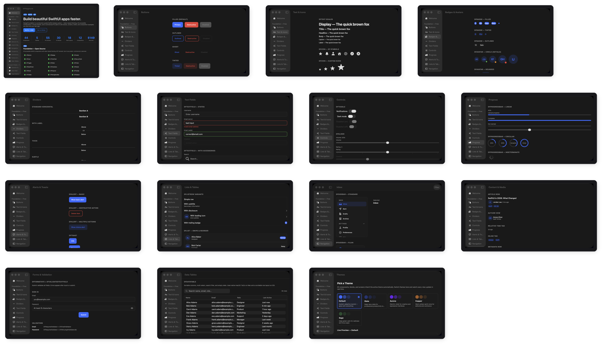

| Preview | Name | Source |
|---|---|---|
| 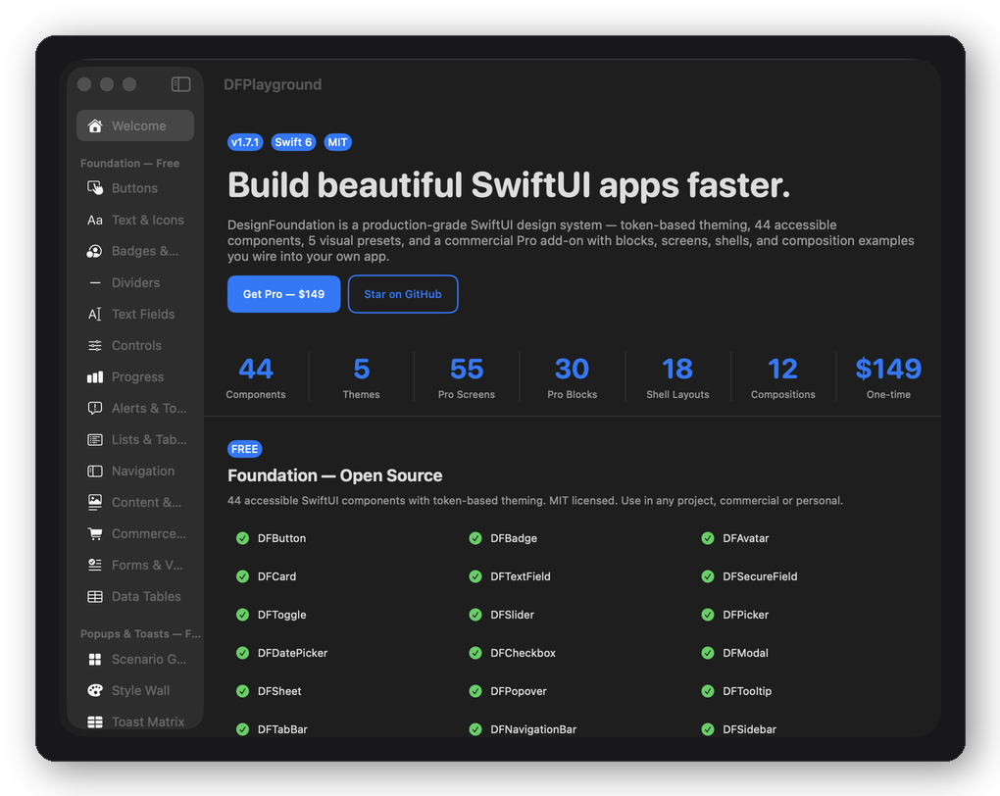 | Welcome | `Sources/DFPlayground/WelcomeView.swift` |
| 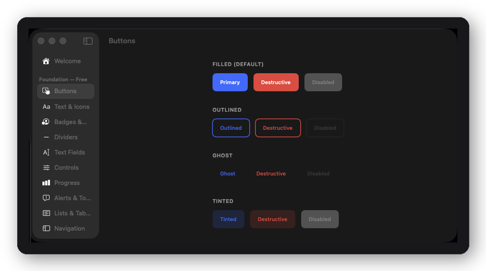 | Buttons | `Sources/DFPlayground/Screens/ButtonsScreen.swift` |
| 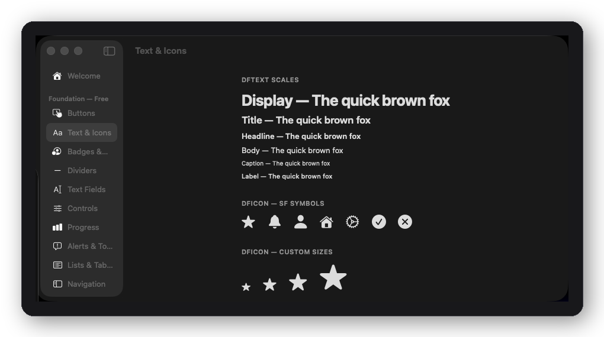 | Text & Icons | `Sources/DFPlayground/Screens/TextAndIconsScreen.swift` |
| 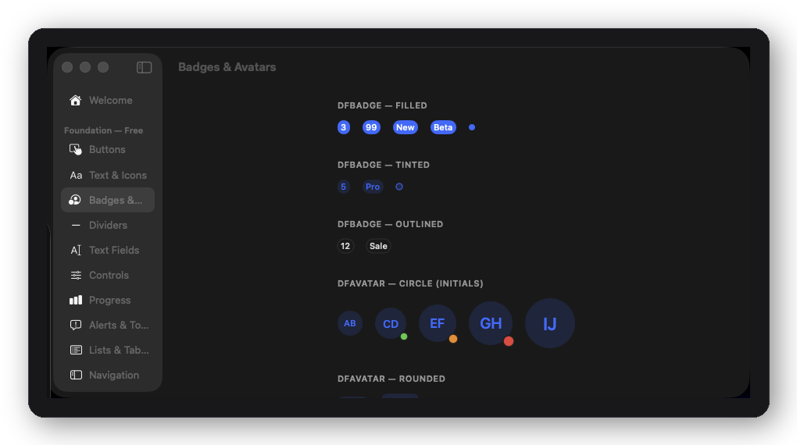 | Badges & Avatars | `Sources/DFPlayground/Screens/BadgesAndAvatarsScreen.swift` |
| 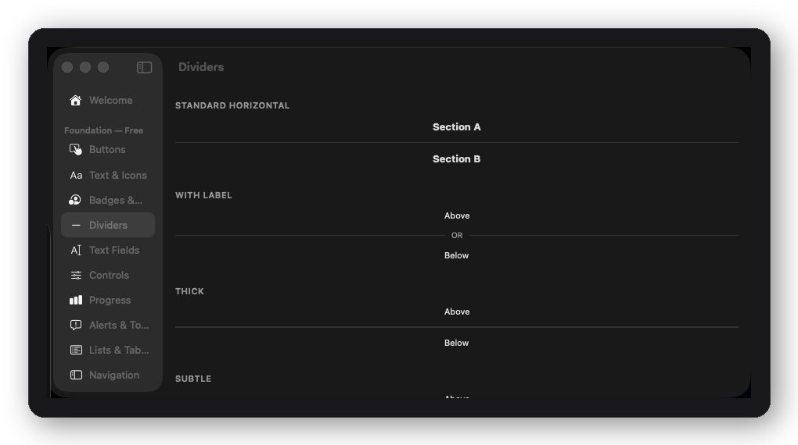 | Dividers | `Sources/DFPlayground/Screens/DividersScreen.swift` |
| 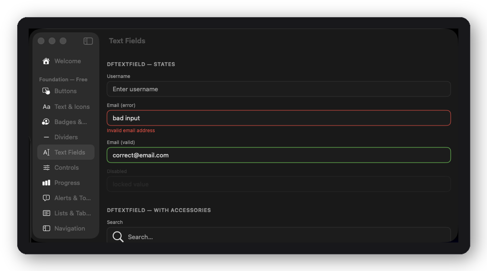 | Text Fields | `Sources/DFPlayground/Screens/TextFieldsScreen.swift` |
| 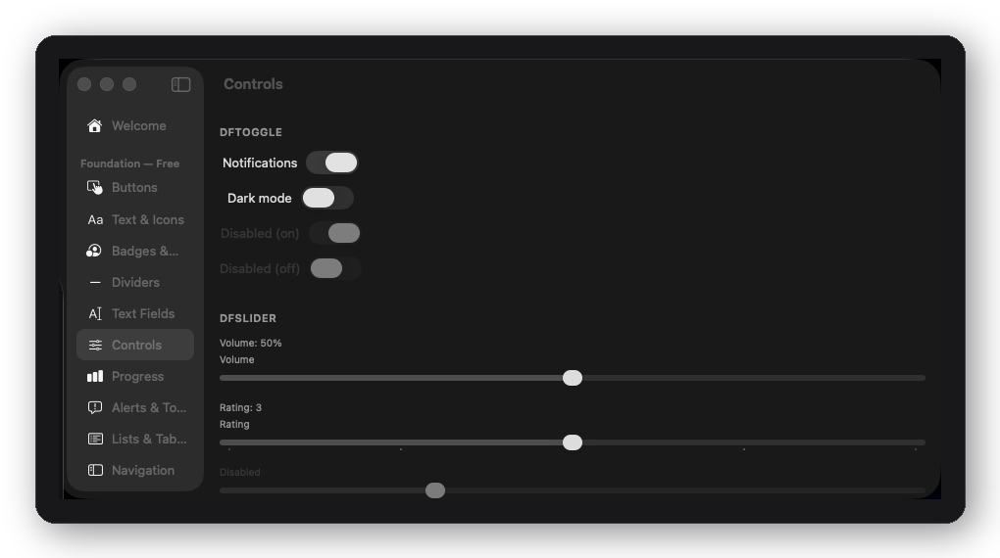 | Controls | `Sources/DFPlayground/Screens/ControlsScreen.swift` |
| 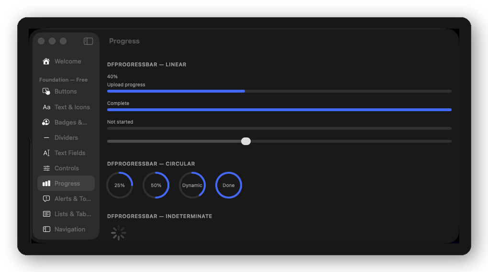 | Progress | `Sources/DFPlayground/Screens/ProgressScreen.swift` |
| 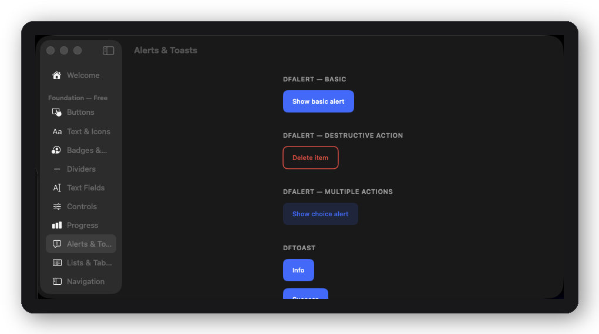 | Alerts & Toasts | `Sources/DFPlayground/Screens/AlertsAndToastsScreen.swift` |
| 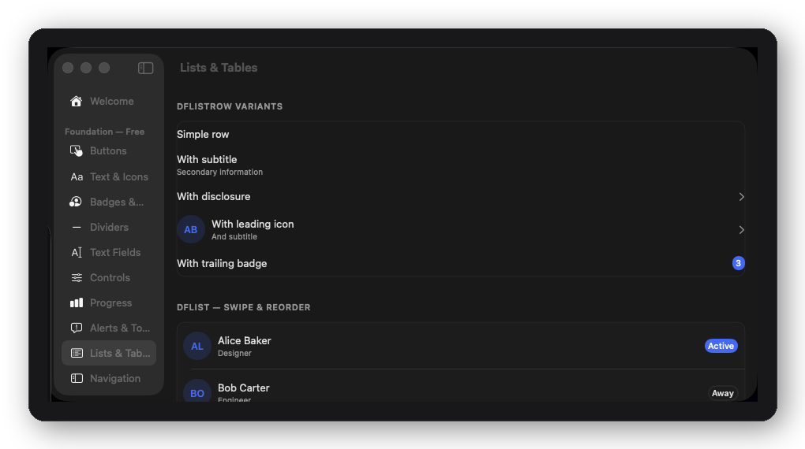 | Lists & Tables | `Sources/DFPlayground/Screens/ListsAndTablesScreen.swift` |
| 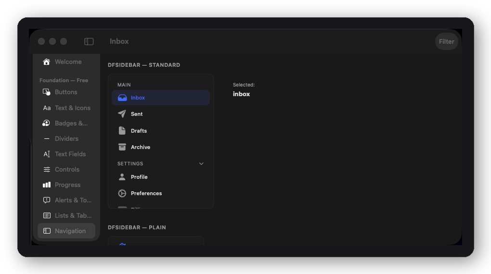 | Navigation | `Sources/DFPlayground/Screens/NavigationScreen.swift` |
| 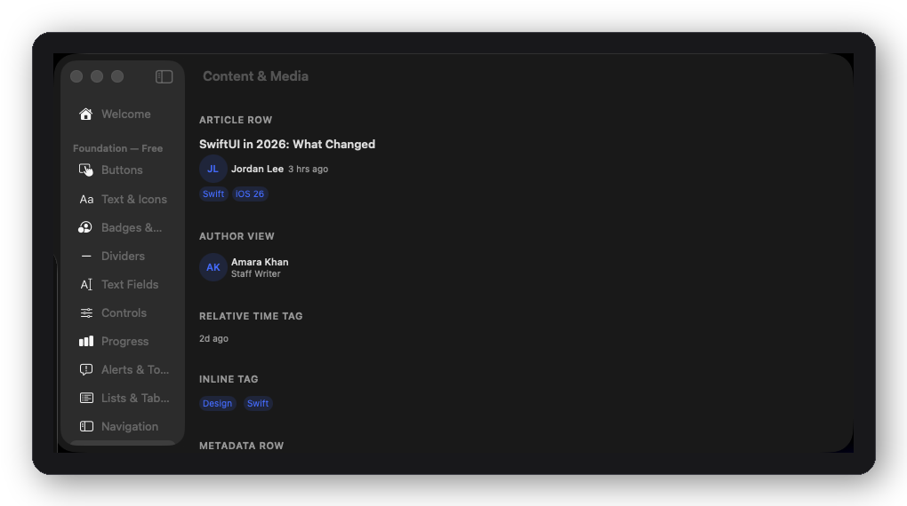 | Content & Media | `Sources/DFPlayground/Screens/ContentPrimitivesScreen.swift` |
| 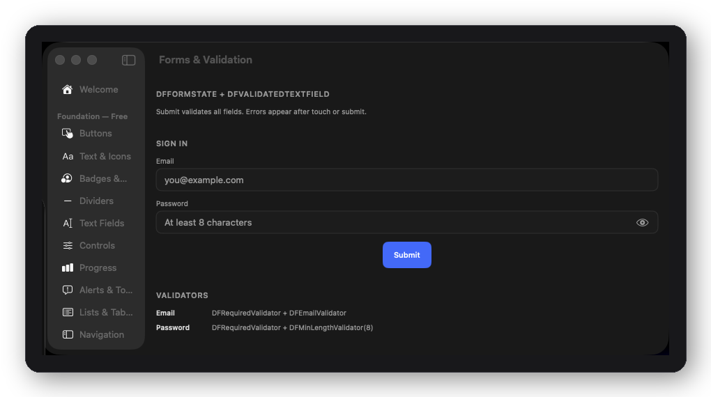 | Forms & Validation | `Sources/DFPlayground/Screens/FormsValidationScreen.swift` |
| 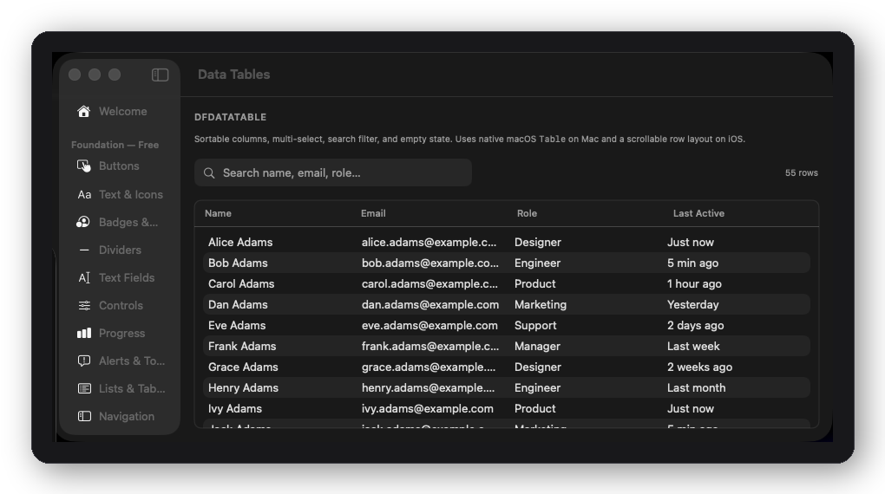 | Data Tables | `Sources/DFPlayground/Screens/DataTablesScreen.swift` |
| 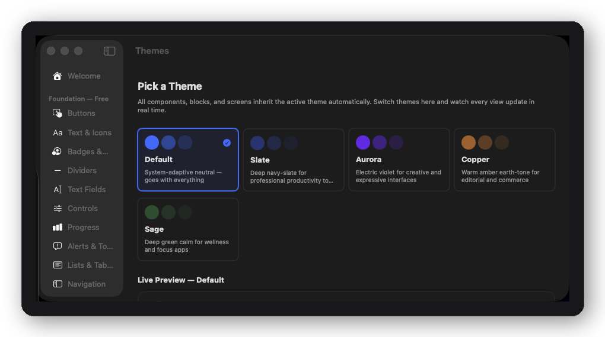 | Themes | `Sources/DFPlayground/ThemePickerView.swift` |

## Pro Upgrade

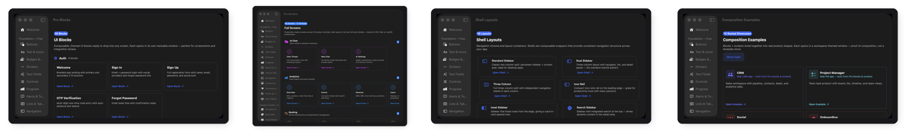
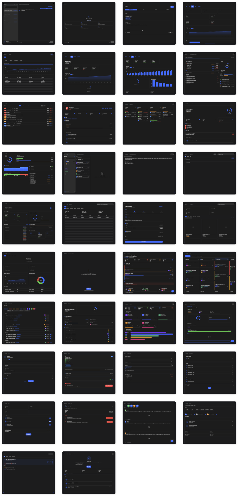
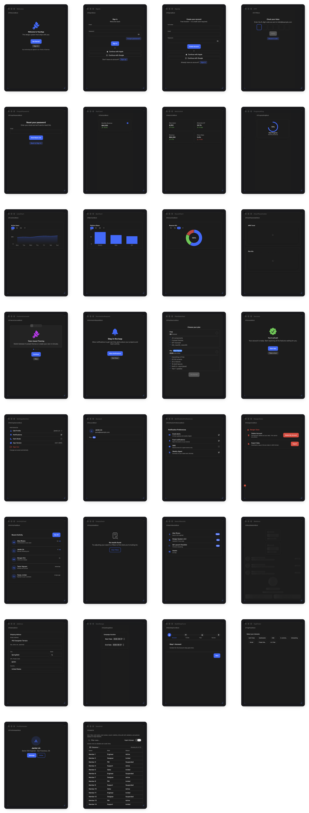

